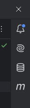
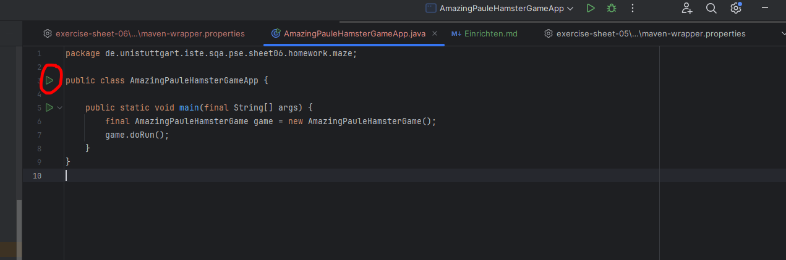

# Gute Nachrichten
Ich habe herausgefunden, was man tun kann, falls IDEA das Projekt nicht als Projekt erkennt.

In der Leiste rechts oben gibt es als 4. Reiter ein 'm'

Dort muss man auf '+' und dann den neuen 'exercise-sheet-xx' auswählen, dann erkennt IntelliJ wieder dass da etwas ausgeführt werden soll.

Wenn alles geklappt hat muss man gar keine Configurations mehr selbst erstellen. Man öffnet die enstprechende Datei '...GameApp.java' und kann dort direkt über das grüne Dreieck ausführen:

