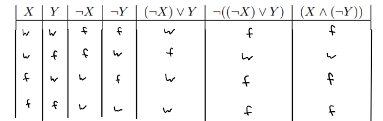

# Aufgabe 1
## a)
- Wenn Paule den Sonnenaufgang beobachtet, schaut er nach Osten und steht vor keiner Wand
- Entweder Paule blickt nach Osten und steht nicht vor einer Wand oder Paule kann den Sonnenaufgang nicht beobachten
---

## b)


## c)
```java 
    if (paule.canViewSunrise()) {
        paule.direction = DIRECTION.East;
        paule.frontIsClear = True;
    }
```

# Aufgabe 2
## a)
strikte Boolesche Operatoren überprüfen immer beide Bedingungen, selbst wenn es 'gar nicht nötig' wäre.
Im und-Fall kann der Vergleich gar nicht mehr einen wahr-Wert annehmen, falls der 1. Ausdruck falsch ist, da beide Seiten wahr sein müssten. 
Es ist somit also unnötig die 2. Seite noch zu prüfen. 
Somit kann man 1. Fehler vermeiden (Vorlesungsbeispiel 1/x), aber auch effizienteren Code schreiben.
Die Semistrikten Operationen in Java prüfen also nur dann die 2. Seite, falls nötig, was Ressourcen schonen kann.
und: 2. Seite wird nur geprüft, falls 1. Seite wahr
oder: 2. Seite wird nur geprüft, falls 1. Seite falsch
```java
/*
        ...
 */
    void moveNorthIfPossible() {
        if (this.getDirection() == Direction.NORTH && this.frontIsClear() ) {
            this.move();
        }
    }
    // Wenn && ein strikter Boolescher Operant wäre und die Direction nicht North wäre, dann würde trotzdem geprüft werden,
    // ob frontIsClear. Da wäre überflüssig, da die Operation eh nicht ausgeführt werden könnte. Somit brauchen wie einen semistrikten Operant.
```
## b)
i. 
- E1 kann ausgewertet werden und gibt den Wahrheitswert false zurück.
- E2 Fehler, kann nicht ausgwertet werden.
- E3 Fehler, da (ham.grainAvailable() && ham.frontIsClear()) einen Fehler gibt (NullReference)
ii. 
- E1 kann ausgewertet werden und gibt den Wahrheitswert false zurück.
- E2 Fehler, kann nicht ausgwertet werden.
- E3 kann ausgwertet werden. Wird zu ``True == False``, al**a**o wird False ausgegeben als Wahrheitswert.

# c)
In E3 
```java
    ham == null || (ham.grainAvailable() && ham.frontIsClear()) == false
        // -->
    !(ham == null || ham.grainAvailable()) && ( (ham == null || ham.frontIsClear()) 
```

## Aufgabe 3

### a)

- `grainNumber` sollte niemals kleiner sein als `-(maximumOverdraft)`
- `maximumOverdraft` muss stets eine Ganzzahl ≥ 0 sein
- `hamster` muss ein initialisierter Hamster auf einem `territory`  sein

---

### b)

- Man sollte lieber klar unterscheiden zwischen einem SharedBankAccount und einem BankAccount. Für Benutzer des Interfaces könnte es sonst schwer zu verstehen sein, was der Unterschied zwischen beiden sein soll, wenn doch in beiden Fällen auch nur ein Hamster Inhaber des Bankkontos sein könnte.
- Es ist vom Stil falsch und kann leicht zu Fehlern führen, wenn man null-Referenzen als Basiswerte verwendet. Besser wäre es hier Optionals einzuführen. Am Besten wäre aber natürlich eine zwangsläufige Unterscheidung zwischen einem BankAccount und SharedBankAccount.
- Ein Benutzer des Interfaces könnte Versuchen den secondHamster direkt anzusteuern, was zu einer NullPointerException führen würde.

---

### c)

Anmerkung: `depositGrains`  sollte auch als einen Parameter vom Typ `Hamster` aufzählen, sodass zunächst überprüft werden kann, ob der Hamster auch genügend Grains bei sich hat und ob auch der richtige Hamster gerade versucht grains aufzubuchen. (Defensiv)

Vorbedingungen `@requires`

- Der Aufrufer besitzt mindestens so viele Grains wie eingezahlt werden sollen.
- `grains` > 0
- Der aufrufenden Hamster ist der Kontoführende Hamster `this.hamster` .

Nachbedingungen `@ensures`

- Der neue Wert von grainNumber wird um `grains` erhöht.

---

### d)

Vorbedingungen `@requires`

- `grains <= grainNumber + maximumOverdraft`  Es werden nicht mehr grains abgebucht als es grainNumber und der entsprechende maximumOverdraft zulassen = das Konto wird nicht weiter als zulässig überzogen.
- `grains`  > 0
- Der aufrufende Hamster ist der Kontoführende Hamster `this.hamster`

Nachbedingungen `@ensures`

- die neue grainNumber wurde um grains verringert.

---

### e)

null:

Eine Entität speichert eine Referenz zu Daten im Heap, also die Position an der die entsprechenden Daten im Heap gefunden werden können (ähnlich wie ein Index). Wenn eine Entität erstellt wird, ohne dass eine Allokierung durchgeführt wird `Hamster hamster;`  dann ensteht eine Entität die einen sog. NullPointer hält, also der eine Referenz fehlt.

this:

Beim Aufruf einer Methode werden neben allen Arugementen noch eine weitere Information an die Methode überliefert, nämlich welches genaue Objekt die Methode verwendet. Eine Referenz zu diesem Objekt hält `this` . Durch `this` können also Methoden, anders als Funktionen, die Daten des Objekts direkt abrufen oder modifizieren oder andere Methoden des Objekts Aufrufen.

---

### f)

1. 1 firstAccount wird initialisiert und erhält 5 Körner.
2. 3 thirdAccount wird initialisiert und herählt 3 Körner.
3. 6 firstAccount werden 30 weitere Körner hinzugefügt.
4. 7 der Entität firstAccount wird die Referenz zu den Daten von thirdAccount zugewiesen. → firstAccount zeigt auf die selben Daten wie thirdAccount
5. 9 firstAccount.getGrainNumber(); gibt 3 zurück

—

1. 2 secondAccount wird initialisiert und erhält 25 Körner
2. 5 der Entität secondAccount wird die Referenz zu den Daten von firstAccount zugewiesen. → secondAccount zeigt auf die selben Daten wie firstAccount
3. 6  firstAccount werden 30 weitere Körner hinzugefügt. Da secondAccount eine Referenz auf die selben Daten hält…
4. 10gibt secondAccount.getGrainNumber(); nun 35 zurück

—

1. 3 thirdAccount wird initialisert und erhält 3 Körner
2. 11thirdAccount.getGrainNumber(); gibt 3 zurück

---

### g)

```java
BankAccount paulesAccount = new Hamster(...);
BankAccount bielefeldsAccount;

bielefeldsAccount.transferGrainsTo(paulesAccount, 10);
// NullPointerException da bielefeldsAcocunt nie konstruiert/allokiert wurde.
```

---

### f)

statische Codeanalysen können durch Controlflow analyse eine NullPointerException immer dann finden, wenn diese nicht von außen ausgelöst werden können, also durch beispielsweise externe API Abfragen, Requests wie Beispielsweise HTTPS requests oder User Input.

---


https://www.jetbrains.com/remote-development/gateway/