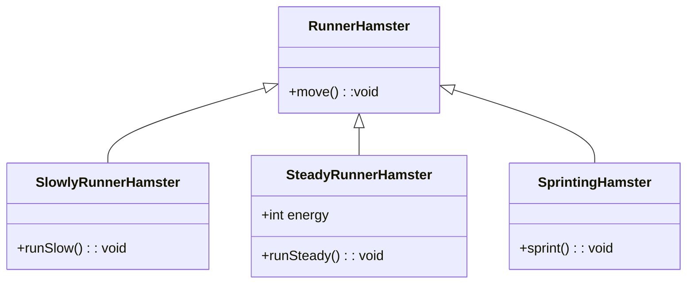
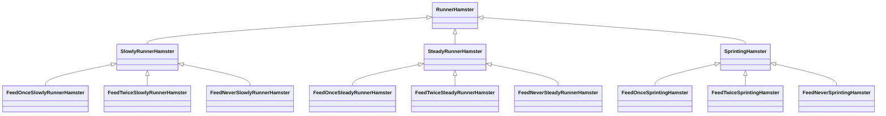

# Aufgabenblatt 07
Mika Hepper - st193543@stud.uni-stuttgart.de - 3787375

Fabian Kirschenmann - st193208@stud.uni-stuttgart.de - 3787773

---

# Aufgabe 1
## a)



---

## b)
1. Erstellung einer Strategie-Schnittstelle
    - Man erstellt ein Interface, das alle gemeinsamen Methoden besitzt, die von einer bestimmten Strategie implementiert werden müssen.

```java
public interface OlympicHamster() {
    void move();
}
```

2. Erstellen von verschiedenen Strategien
    - Man erstellt verschieden Klassen, die alle das Strategie-Interface implementieren, und somit
    - auf verschiedene Arten das Problem zu lösen versuchen.

```java
public class SlowlyRunnerHamster() implements OlympicHamster {
    @Override
    void move() {
        this.runSlowly();
    }
    
    ...
}

public class SteadyRunnerHamster() implements OlympicHamster {
    @Override
    void move() {...}
    
    ...
}
```

3. Funktion, die die Strategie durch Polymorphen zugriff verwendet
    - Eine Operation die nach einem Parameter vom Strategie-Interface verlangt.
    - Durch die Polymorphie wählt Java dann die Methode der Strategie aus, die dem dynamischen Typ des überreichten Objekts entspricht.
    - Dadurch können später auch einfach neue Strategien entwickelt werden, die das Strategie-Interface implementieren, ohne dass diese Methode verändert werden muss.

```java
void letHamsterRun(OlympicHamster athlete) {
    athlete.move();
}
```

4. Verwendung   
  - Dank des polymorphen Zugriffs sieht der Aufruf von letHamsterRun zweimal fast identisch aus.
  - Sollte jemand einen weiteren OlympicHamster implementieren wollen, kann er einfach vom Interface vererben, und diesen dann genauso übergeben, ohne 
  - änderungen an letHamsterRun(...) durchführen zu müssen.

```java
... 

athlete1 = new SlowlyRunnerHamster();
athlete2 = new RunningHamster();

letHamsterRun(athlete1);
letHamsterRun(athlete2);

...
```

**Warum ist das in unserem Fall besser?**
- Leichtes hinzufügen weiterer anderer olympischer Hamster.
- Einfacher Zugriff bei der Verwendung, man spart sich viele if-else-Blöcke.
---

## c)


---

# Aufgabe 2

## a)
- paule hat den statischen Typ Hamster
- paule könnte mit einer 50% wahrscheinlichkeit den dynamischen Typ RotatingHamster haben, ansonsten behält er den dynamischen Typ Hamster.
- Die Entscheidung fällt in Zeile 5, da dort entschieden wird, ob der dyn. Typ von paule sich durch die Verzweigung ändert oder nicht. 

---

## b)

```java
public void runGame() {
    Hamster paule = new Hamster(/*territory, location, ...*/);
    Hamster hamster = new RotatingHamster(/*territory, location, ...*/); 

    if (Math.random() < 0.5) { // 
        paule = hamster;
    }

    paule.move();
    paule.turnLeft();
    paule.move(5); // Wirft einen Fehler, falls paule den dyn. Typ Hamster besitzt.
}

```
- es handelt sich um einen dynamisch semantischen Fehler, da der Kompiler nur paules statischen Typen prüfen kann, die Typänderung durch die Verzweigung also vom Kompiler nicht bemerkt werden kann.
- daraus folgt, dass der Fehler erst während der Runtime auftreten wird.

---

## c)
**dynamisches Binden**:
Durch das dynamische binden, kann der RotatingHamster in Zeile 9 auf die move-Methode die keine Argumente erwartet, nämlich die move-Methode von Paule zurückgreifen,
aber auch auf die move-Methode des RotatingHamster wie in Zeile 11, welcher ein Integerargument erwartet (Falls es sich tatsächlich um einen RotatingHamster handelt, sonst wird dort ein Fehler geworfen.

**polymorphe Zuweisung**:
Sieht man in Zeile 6, wo paule eventuell den dynamischen Typ RotatingHamster annehmen kann, trotz, dass er den statischen Typ Hamster hat.

---

## d)
Falls durch Mehrfachvererbung, zwei Klassen die gleiche Methode übergeben, mit den gleichen Parameterlisten, dann ist unklar, 
ob das Programm dadurch einen Fehler werfen wird, oder welche Methode dann bevorzugt wird (und welche überschrieben). (Diamantproblem)

=> Unübersichtlich, Mehrdeutig
=> Lösung: Mika anrufen und mit ihm Date ausmachen: 0173 1748614
