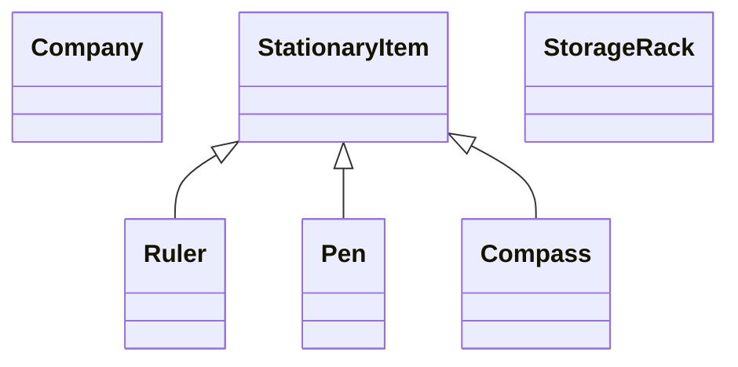

# Aufgabenblatt 10
Mika Hepper - st193543@stud.uni-stuttgart.de - 3787375

Fabian Kirschenmann - st193208@stud.uni-stuttgart.de - 3787773

---

# Aufgabe 1
## a)

- LazyHamster.move() generiert eine Zufallszahl zwischen 0 und 1.
- Falls die generierte Zufallszahl > 0.7 ist, macht der Hamster einen herkömmlichen wie gewohnten move() - also einen Schritt nach Vorne in Blickrichtung.
- Ansonsten gibt der Hamster in die GUI-Konsole aus: "Too Lazy"

**@requires**

Das Tile in Blickrichtung vor dem Hamster ist keine Wand, sondern ein belegbares Tile


**@ensures**

Nichts, denn es ist zufall, ob der Hamster einen Schritt macht.

---

## b)

- CheatingHamster.move() lässt den Hamster 2 herkömmliche moves() durchführen, der Hamster bewegt sich also 2 Felder in Blickrichtung.

**@requires**

Die beiden Tiles in Blickrichtung vor dem Hamster sind keine Wände, sondern belegbare Tiles.

**@ensures**

Der Hamster macht 2 Schritte vorwärts in seine entsprechende Blickrichtung.

---

## c)

Die Vorbedingungen der Kinder sind eine Teilmenge der Vorbedingungen der Eltern.
D.h.:

    > Eine Kindmethode darf die Vorbedingungen nicht verschärfen.

Für LazyHamster.move() ist das erfüllt.
Für CheatingHamster.move() ist das nicht erfüllt, denn er verlangt, dass 2 Felder in Blickrichtung frei sind, Hamster.move() verlangt allerdings nur 1 Feld in Blickrichtung.

Die Nachbedingungen der Eltern sind eine Teilmenge der Vorbedingungen der Kinder.
D.h.:

    > Eine Kindmethode darf die Nachbedingungen nicht abschwächen.

Für LazyHamster.move() ist das nicht erfüllt, denn für diesen kann die Nachbedingung, dass der Hamster nach der Operation genau ein Feld in seine Blickrichtung bewegt wurde, nicht garantiert werden.
Für CheatingHamster.move() ist das nicht erfüllt, denn dieser wurde 2 Schritte in Blickrichtung bewegt, die Nb. der Elternklasse geben allerdings exakt ein Schritt in Blickrichtung vor.

---

## d)

```java
// ...

Hamster paule = game.getCurrentHamster();

// ...
/*
        paule makes a step if the user presses a button whilst called and if the front is Clear.
        
        @ensures: A user button Press will be handled correctly, if a button was pressed, paule might move, if there's not a wall in front.
 */
void movePauleIfButtonPress(Button button) {
    if(button.isPressed() && paule.frontIsClear()) {
        paule.move();
    }
}
```

Es ist nicht gesichert, dass paule ein nativer Hamster ist, es könnte auch ein CheatingHamster sein.
Falls, ``dann würde movePauleIfButtonPress()`` das Spiel eventuell abstürzen lassen, da paule möglicherweise versucht auf ein Wand-Feld zu laufen,
obwohl der Programmierer eigentlich versucht hat dies durch eine defensive Überprüfung zu verhindern.

---

# Aufgabe 2

### Anmerkung (nur zur Hilfe):


---

## a)
Eine geeignete Datenstruktur wäre ``Collections.ArrayList``, da die Regalfächer eine feste größe haben werden, also man nicht den Nachteil haben wird, dass sich größen von Arrays schlecht ändern lassen, und da man ArrayLists sehr schnell an einem bestimmten Index i abrufen kann, ohne vorher über die gesamte Liste zu iterieren wie bei einer LinkedList. Außerdem werden alle Daten im Array den Uniformen Typ (bzw. Elterntyp) ``StorageRack`` haben.

---

## b)
Am sinnvollsten ist es hierfür eine Map zu verwenden. Ich entscheide mich für die Hash-Map, da diese das auffinden von Objekten anhand Ihres Hash sehr schnell ermöglicht. Sollte das Lager aber enorme größen Annehmen, könnte man auch eine TreeMap in erwägung ziehen, da diese Speichereffizienter ist.

---

## f)
Ein Stack macht am meisten Sinn. Er folgt dem LIFO (last-in-first-out) Prinzip so wie in der Aufgabenstellung beschrieben.
Das Item was schon längsten im Stack verharrt, sollte als erstes verpackt werden damit es Versandbereit ist.
Außerdem werden hier keine Optionals mehr benötigt, da es sinnfrei ist, ein Optional.isEmpty() == true im Stack unterzubringen, man kann ja nicht etwas leeres verpacken.

---

## i)
Es muss auf jeden Fall ein Set verwendet werden, da jeder Kunde natürlich nur einmal etwas bestellen kann.
Ein HashSet ist am schnellsten, um zu ermitteln, ob ein Kunde bereits einmal etwas bestellt hat.
Die extra-Memory eines HashSet ist minimal.
Beim abrufen von Kunden ist eine Sortierung wahrscheinlich irrelevant.
Falls man gelegentlich Abfragen muss, welches die Kunden sind, die zeitlich zuletzt bestellt haben, könnte man ein TreeSet in erwägung ziehen.
