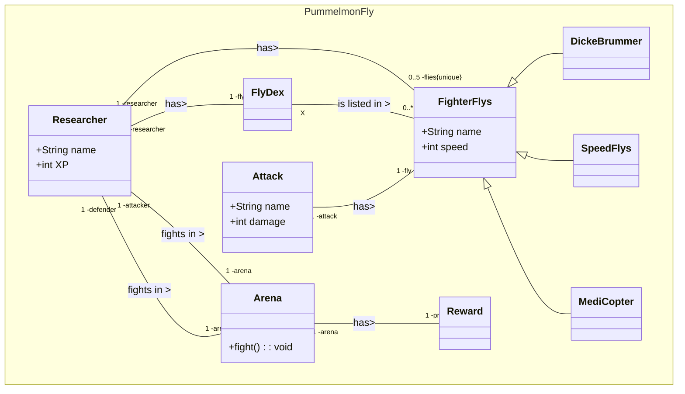

# Aufgabe 1

## b)
Klassendiagramme

--- 
## c) 
- Strukturenorientierte Diagramme beziehen sich auf die Verteilung der Software auf die Hardware (Klassen Diagramm)
- Verhaltensorientierte Diagramme beziehen sich nur auf die Funktion der Software und was diese macht (Sequenzen Diagramm)
---
## d)
- Aggregation: Eine Aggregation beschreibt die Zusammensetzung von Objekten zu einem zusammengesetztem Objekt. Also z.B. die Klasse Tisch, welche aus den Klassen Beinen und Platte besteht.
- Komposition: Eine Komposition ist eine bestimmte Aggregation, bei der die Existenz der Teile von der Existenz des Ganzen Abhängt. (z.B. Klasse Haus besteht aus Stockerken und Wänden, diese Existieren aber nur, wenn auch die Klasse Haus existiert)

---
## e) 
