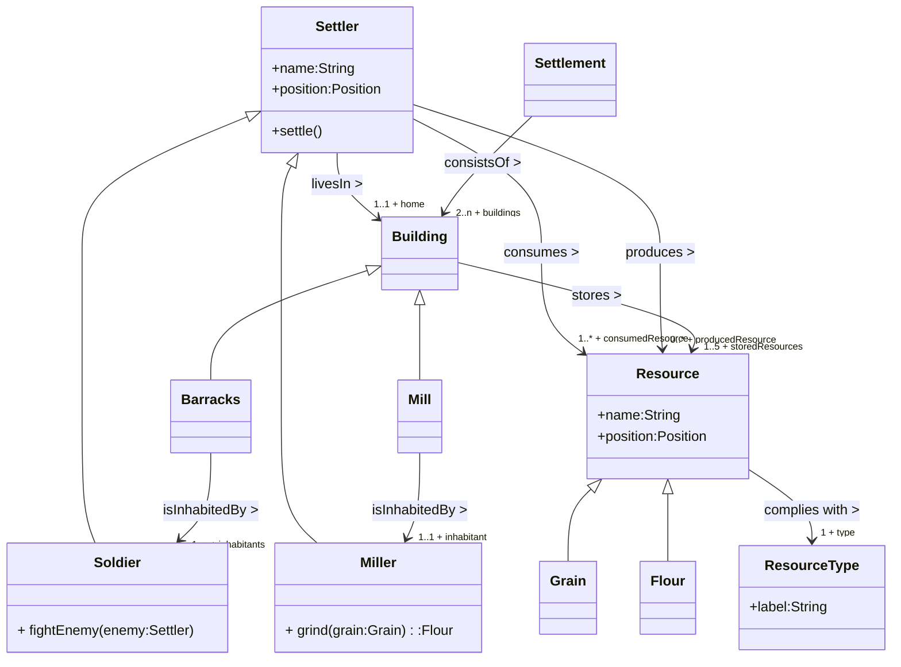

# Aufgabenblatt 11
Mika Hepper - st193543@stud.uni-stuttgart.de - 3787375

Fabian Kirschenmann - st193208@stud.uni-stuttgart.de - 3787773

---

# Aufgabe 1

```mermaid
classDiagram
    Settler <|-- Soldier
    Settler <|-- Miller
    
    Resource <|-- Grain
    Resource <|-- Flour   
    
    Building <|-- Mill
    Building <|-- Barracks
        
    Settler --> "1..* + consumedResource" Resource : consumes >
    Settler --> "0..* + producedResource" Resource : produces >
    Resource --> "1 + type" ResourceType : complies with >

    Settler --> "1..1 + home" Building : livesIn >
    
    Mill --> "1..1 + inhabitant" Miller : isInhabitedBy >
    Barracks --> "1..n + inhabitants" Soldier : isInhabitedBy >
    
    Building --> "1..5 + storedResources" Resource : stores >
    
    Settlement --> "2..n + buildings" Building : consistsOf >

    class Settler{
        +name:String
        +position:Position
        +settle()
    }

    class Soldier{
        + fightEnemy(enemy:Settler)
    }
    
    class Miller{
        + grind(grain:Grain):Flour
    }
    
    class Flour{
        
    }

    class Grain{
    }

    class Resource{
        +name:String
        +position:Position
    }

    class ResourceType{
        +label:String
    }
    
    class Building{
        
    }
    
    class Mill{
        
    }
    
    class Barracks {
        
    }
    
    class Settlement {
        
    }
```