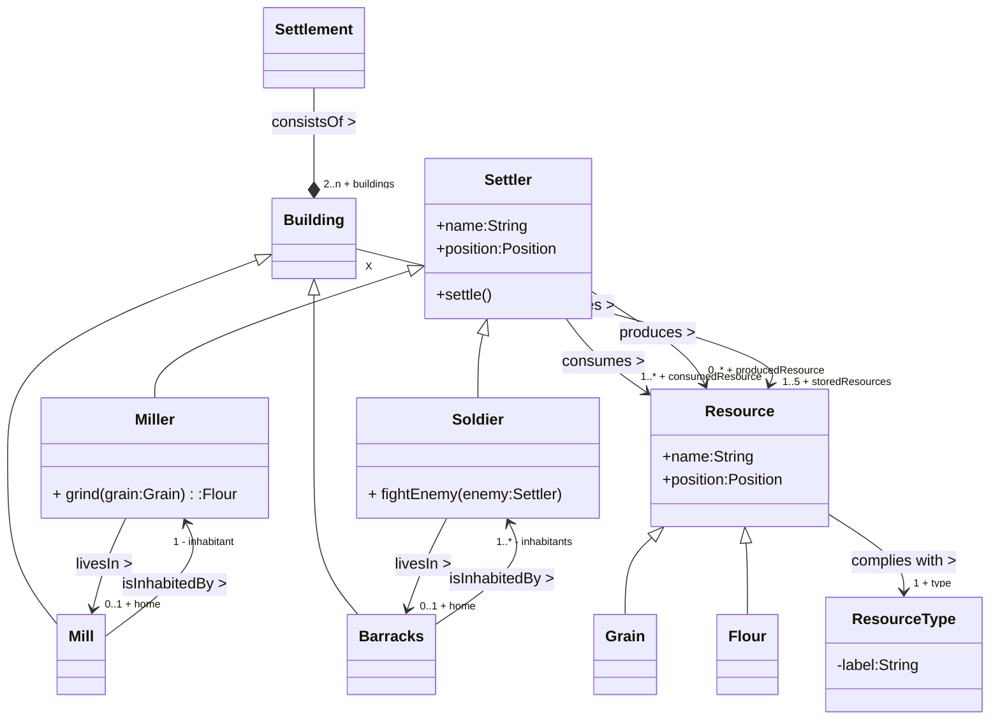
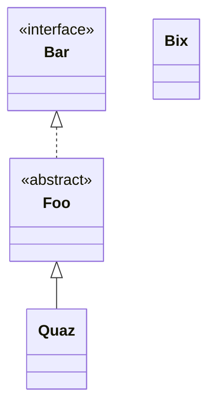

# Aufgabenblatt 11
Mika Hepper - st193543@stud.uni-stuttgart.de - 3787375

Fabian Kirschenmann - st193208@stud.uni-stuttgart.de - 3787773

---

# Aufgabe 1


---

# Aufgabe 2
## a)
Das Programm erwartet einen Input über die Konsole.
Der Input soll ein Datum sein der Reihenfolge "Jahr", "Monat", "Tag" 
Das Programm unterscheidet zwischen verschiedenen Formaten, die Zahlen können getrennt werden durch:
    - '-'
    - '/'
    - '.'
Das Programm nutzt dann die Calendar-API, um den Wochentag dieses Datums zu ermitteln, und gibt diesen in die Konsole aus.

Beispieleingaben:
```Commandline
 > 2005-04-16 
 // -> Saturday
 > 2025/01/01 
 // -> Wednesday 
```

---

## b)

```Commandline
 > 2005.04.16
 // -> Exception in thread "main" java.lang.ArrayIndexOutOfBoundsException: Index 0 out of bounds for length 0
	at exercise/de.unistuttgart.iste.sqa.pse.sheet11.homework.cleancode.SomethingWithCalendars.main(SomethingWithCalendars.java:30)
```

Die Split-Funktion erwartet einen Regex-Ausdruck. Dieser ist falsch, denn
in RegEx wird der Punkt als Spezialsymbol angesehen, dadurch funktioniert der split nicht wie erwartet.
Deshalb ist die übergebene Liste auch falsch und dadurch kann am Ende die Kalender API die Liste nicht in ein korrektes Datum umwandeln.

---

## c)
 - Man sollte eine neue Methode erstellen `getWeekdayFromString()` und damit den langen Code in Einzelaufgaben zerteilen.
 - Die if-elif-else Verzweigung hat keine `else`-Klausel, die falsche User-Eingaben verarbeiten sollte.
 - Die Variablen wurden schlecht benannt. `'fs'` ist kaum Aussagekräftig, genauso wie `'cal'`, `'wd'`

---

# Aufgabe 3)

