# Vorlesung 12 Java Klassen erstellen

## Abstraktion durch Funktionale Dekomposition
Datenabstraktion: Klassen
- Operationen (müssen "klein" sein, bis zu ca. 10 Zeilen -> Vor-/Nachbedingungen bleiben klein und Überschaulich, wenn zu Groß zerlegen in mehrere Operationen)
- Objektvariablen

Algorithmusabstraktion: Routinen -> Methoden
- (Bottom-Up: Erfassen von exist. Algorithmen, womöglich zur Wiederverwendung
Top-Down: Platzhalterroutinen)
- Prozeduren: Liefern kein Ergebnis (=Kommando), Aufrufe sind Instruktionen ```void doSomething(...) ```
- Funktionen: Liefern einen Ergebniswert (=Abfrage), Aufrufe sind Ausdrücke, ```ReturnType f(...) ```

**Klassenelemente**

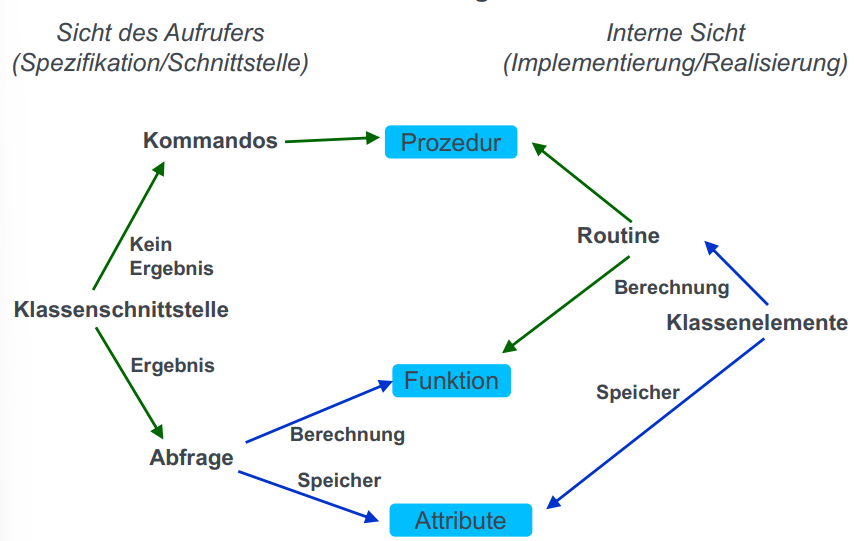

## Konstruktoren
(<=> semantische gesehen auch nur Operationen)

**Deklaration:**
````java
//Konstruktor, Operationsbezeichner muss mit Klassenbezeichner übereinstimmen
public Location (final int row, final int column) {
    
}
//Aufruf eines Konstruktors
Location loc = new Location(0,0);
````
Wdh.: 
- Klasseninvarianten sind Bedingungen, die zwischen beliebigen Operationsausführung auf den Objekten der Klasse gelten müssen. (=Nachbedingung der Konstruktoren)
- Nachbedingung ist eine Bedingung, die einer Operation für eine korrekte Realisierung durch den Anbieter auferlegt ist.

## Prinzip des Gleichförmigen Zugriffs (UAP)
- Für den Aufrufer sollte es keine Rolle spielen, ob ein Ergebnis durch Berechnung oder Speicherzugriff bestimmt wird.
- Technisch ausgedrückt: Abfragen sollen dem Aufrufer immer gleich zur Verfügung gestellt werden: Unabhängig, ob der Wert durch Speicherzugriff oder Berechnung bestimmt wird. (Speicherverbrauch vs. Performance)
- also wenn dann in der Methode direkt ausrechnen oder auf ein Attribut verweisen, welches dauerhaft den Wert bei jeder änderung ausrechnet
````java
Integer getRectangleArea() {
    return area;
}
// vs.
Integer getRectangleArea() {
    return width * height;
}
````

## Zugriffskontrolle
(Sichtbarkeiten)
Wichtig, um kontrollieren zu können, elche Aufrufer was dürfen.

Am meisten zugreifbar bis zu am wenigsten zugreifbar:
- public (Nutzbar von überall)
- protected (Nutzbar innerhalb von Klassen im selben Package und in Unterklassen)
- default (Nutzbar aus Klassen innerhalb desselben Packages)
- private (Nutzbar innerhalb des Klassenrumpfs)

=> Immer so *restriktiv* wie möglich Sichtbarkeiten realisieren

## Defensives und Offensives Programmieren
- Defensives Programmieren:
  - Explizite Prüfung der Bedingungen. Bei Nichterfüllung wird eine Ausnahme geworfen und der Zustand nicht geändert.
  - wird für alle Programmteile benutzt, die durch Dritte zugänglich sind, z.B. public Operationen.
````java 
  public void storeName(final String name) {
    if (name == nul || name.isEmpty()) { // es wird explizit geschaut, ob die Bedingungen erfüllt sind und falls nicht, wird eine Exception geworfen.
        throw new IllegalArgumentException("Employee name must not be null/empty");
    }
    internalStore(name);
}
  ````
- Offensives Programmieren: 
  - Bedingungen werden mittels assert zur Entwicklungszeit und zur Produktionszeit deaktiviert.
  - wird für alle internen Operationen eingesetzt
  - assert-Anweisungen werden normalerweise *nicht* ausgeführt. Um asser-Anweisungen auszuführen, muss die JVN (Java Virtual Machine) mit der Option -ea gestartet werden.
````java
private void internalStore(final String name) {
    assert name != null && !name.isEmpty(); //wird nicht ausgeführt, kann aber durch -ea ausgeführt werden (im Compiler)
    db.storeEmployeeName(name);
    -ea 
}
 ````
## statische Klassenelemente
Problem: In einigen Fällen wollen wir z.B. Variablen mit allen Instanzen der Klasse teilen. (Zähle alle Hamster, die wir bislang instanziiert haben)

**Statische Attribute** liegen in einem Speicherbereich, der bei der Definition der Klasse angelegt wird. 
````java 
static //kann bei Attributen und Operationen hinzugefügt werden 
static int hamsterCount;//existiert genau einmal pro Klassendefinition in der VM(Virtual Machine), geteilt unter allen Instanzen der definierten Klasse, sollte nicht über this zugegriffen werden, sondern hamsterCount
static int getHamsterCount() { //Klassenoperation
    return hamsterCount;
}
static { //statischer Konstruktor, nur 1 mal por Klasse, keine Parameter, kann nur auf andere static Elemente der Klasse zugreifen, keine this-Reference
    hamsterCount = 0;
}
````
Sollen in PSE NICHT benutzt werden (sind nicht thread-sicher, können als globale Variable ausgenutzt werden)


# Vorlesung 14 & 15 Objektorientierte Programmierung (OOP)
## Grundlagen der Vererbung
Vererbung erlaubt es Programmierern, Klassen zu erstellen, die auf existierenden Klassen basieren, eine neue Realisierung zu spezifizieren, während das Verhalten beibehalten wird, um Cod wiederzuverwenden und um die ursprüngliche Software durch öffentliche Klassen und Schnittstellen zu erweitern.
 - In Java durch ``extends``
 - kann auf protected und public Operationen und Attribute zugegriffen werden
 - können protected und public Operationen überschrieben werden
 - möchte man auf Operationen der Elternklasse zugreifen geht dies durch ``super``, bezeichnet immer die nächsthöhere Elternklasse

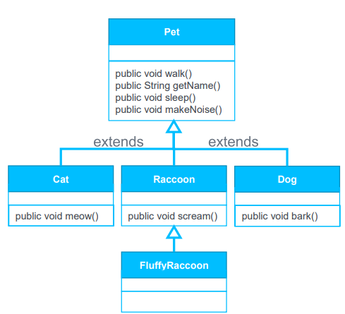

- Alle Tiere(direkte Nachkommen) sind vom Typ Pet(direkter Vorfahre)
- Racoon und FluffyRacoon sind vom Typ Racoon
- Racoon ist direkter Vorfahre von Fully Racoon

**Nichtvererbbare Bestandteile**
- Konstruktoren
- private Attribute 
können nicht vererbt werden, nur wenn in Elternklasse setter-Operation existiert

## abstract
Problem: Zwei verschiedene "Tiere" z.B. besitzen beide Operation ``makeNoise()``, Operationsname gleich, Effekt jedoch unterschiedlich

Ziel: ``makeNoise()`` extrahieren ohne eine Basisimplementierung zu geben
- Abstrakte Operationen bieten keine Implementierung
- Abstrakte Klassen und Operationen werden durch das Schlüsselwort ``abstract`` gekennzeichnet, Klasse abstrakt, sobald mind. eine abstrakte Operation enthält
- Es kann keine Instanz(Objekt) von abstrakten Klassen erstellt werden

````java
public abstract class Pet { //new Pet() ist nicht erlaubt da Klasse abstract ist(statisch-semantischer Fehler)
    private String name;
    public String getName() {
        return name;
    }
    public abstract void makeNoise(); //darf nicht private sein und besitzt keinen Operationsrumpf
}
````

## Implementieren von abstrakten Operationen
abstract Operationen müssen in Kind klassen implementiert werden.
Dies funktioniert mit @Override (Überschreibe die spezifizierten Methoden)
Bsp:
```java
abstract class Animal {
    public abstract Food likes();
}
abstract class Mammal extends Animal {
    public abstract int pregnantFor();
}
public class Hamster extends Mammal {
    @Override //informiert den Compiler, dass diese Operation eine spezifizierte, geerbte Operation implementiert (@Override bei nicht-überschriebenen Operationen sind statisch-semantische Fehler)
    public int pregnantFor() {  return 30; }
  
    @Override
    public Food likes() {
        return Food.GRAIN;
    }
}
```
## Überschreiben von existierenden Operationen

Wenn eine Implementierung einer Operation der Elternklasse schon existiert, aber in der Kindklasse zweckmäßiger implementiert werden könnte, wird Überschrieben

````java
//Bsp, oben fortgesetzt:
public class Hamster {
   @Override
    public String toString() {
    return "Hamster [pregnantFor()=" + pregnantFor() + ", Likes()=" + likes() + "]";
  }
  //Überschreibt (redefiniert/ersetzt) die Standartimplementierung, die von Object geerbt wird (toString)
}
````
final (unveränderliche) Klassen können nicht überschrieben werden

## Record-Typen erweiterung
- Dürfen keine anderen Klassen erweitern (extends), da jeder Record-Typ von der abstrakten Klasse Record erbt.
- können Methoden überschreiben und überladene Konstruktoren haben

## Polymorphie
- Problem: Wollen Algorithmen anwendbar auf allgemeine Typen von Objekten und spezialisierte Typen miteinbeziehen. (printPreferredFood() Operation, die die bevorzugte Nahrung für jede Art von Tier ausgibt)
- Lösung:
  - Operation muss in "Animal" (Elternklasse) platziert werden
  - Ausführung muss spezifische Nahrungsvorlieben des tatsächlichen "Animal"-Objekts in Betracht ziehen
    -> Führe eine Operation von einem spezifischen "Animal" aus (Dynamische Bindung)

**Definition: Polymorphie**
````
Eine Bindung (auch bei Zuweisung oder Argumentenübergabe) ist polymorph,
wenn Zielvariable und Quelleausdruck von unterschiedlichem Typ sind.

Eine Entität oder ein Ausdruck sind polymorph, wenn sie zur Laufzeit an unterschiedlichen Typs gebunden werden (als Resultat einer polymorphen Bindung)

Polymorphie ist die Existenz dieser Möglichkeit in einer Porgammiersprache
````

(= wenn Elternklasse Animal ist, können wir einem neun Pet(von Animal) auch einen Hamster zuweisen (anderer Typ), da Hamster von Animal erbt(geeigneter Nachkomme, ist auch ein Tier))
Bsp. wäre, z.b. man erstellt ein neues Tier und schaut ob man einen Hund oder eine Katze will, und jenachdem weist man diesem neuen Tier dann eine schon existierende Katze oder Hund zu.
````java
public class AnimalTest extends Animal {
    void Test(boolean wantDog) { // Das Tier soll also ein Hund sein
        final Dog waldi = new Dog();
        final Cat mau = new Cat();
        Animal pet;
        
        if (wantDog) {
            pet = waldi; //Polymorph, da Typen unterschiedlich sind, geht da Dog Nachkommender Typ von Animal ist
        } else pet = mau;
    } //Der dynamische Typ von pet hängt jetzt also von dem boolean ab
}
````

**Definition: Statische und dynamische Typen**
````
Der statische Typ einer Entität ist der Typ, 
der in iherer Deklaration in dem zugehörigen Klassntext steht 
(Animal pet; //pet vom statischen Typ Animal
 Hamster paule; //paule vom statischen typ Hamster)

Der dynamische Typ einer Entität ist der Typ des (Laufzeit-)Objekts, 
Wenn der Wert einer Entität während einer Ausführung an ein Objekt gebunden wird.
Der dynamische Typ einer Entität MUSS immer ohrem statischen Typ konform sein(ein Nachfahre)
(pet = paule; //dynamischer Typ von pet ist Hamster(bis zur nächsten Zuweisung))
````
**Definition: Dynamisches Binden**
````
Dynamisches Binden (Semantikregel:)
Jede Ausführung eines Operationsausfrufs wird die Version der operation verwenden, 
die dem dynamischen Typ des Zielpobjekt am besten angepasst(die Spezialisieteste) ist.
Man muss also nicht durch 1000de if-abfragen schauen, welcher Typ aktuell zugewiesen ist.
````
## Überladen vs. Überschreiben von Operationen
Häufig will man mehrere Operationen (unterschiedliche Argumenttypen und anzahlen),
die alle dasselbe Verhalten realisieren

Überladen von Operationen, Operatoren mit gleichem Namen aber untersch. werden vom Compiler als unterschiedliche Operationen behandelt.

## Vererbung und Verkettung von Konstruktoren
Wenn eine Kindklasse instanziiert wird, müssen Klasseninvarianten auch für die Elternklassen aufgstellet werden (da die Kindklasse die Attribute und das Verhalten der Elternklassen erbt.)

**Konstruktorenverkettung**
Konstruktoren werden grundsätzlich nicht an die Kindklasse vererbt. 
Sie können jedoch (müssen sogar manchmal) aufgerufen werden.
- Eigenschaften:
  - Verwende super(), um einen der Konstruktoren der Elternklasse aufzurufen (muss der erste Ausdruck des Konstruktors sein)
  - Falls kein Standardkonstruktor in der Elternklasse vorhanden ist, muss der Aufruf explizit erfolgen.
  - super-Aufrufe können überladene Aufrufe sein.

````java
public class Hamster {
    public Hamster() {
        super(); //könnte weggelassen werden, da in  diesem Fall Elternklasse Object ist
        this.interanHamsterTerritory.GameHamster; //irgendein BSP:.
    }
    
    public Hamster(final Territory territory, final Location location, final Direction direction, final Graincount graincount) {
        this(); //Aufruf des Konstruktors weiter oben
        init(territory, location, direction, graincount);
    }
}
````
## Super-Zugriff
- Durch "super.method()" können wir den Code von überschriebenen Operationen wiederverwenden
- z.b. irgendeine Unterklasse, die aber auch moven soll, wie die Elternklasse: super.move();

## Korrektheit: Verträge und Vererbung
**Klasseninvarianten:**
Die Invariante einer Klasse beinhaltet automatisch die Invarianten all ihrer Elternklassen, "und"-verknüpft

**Neudeklaration von Zusicherungen**
Wenn eine Operation neu deklariert wird, dürfen wir:
- Die Vorbedingung beibehalten oder abschwächen
- Die Nachbedingung beibehalten oder verstärken

## Mehrfachvererbung
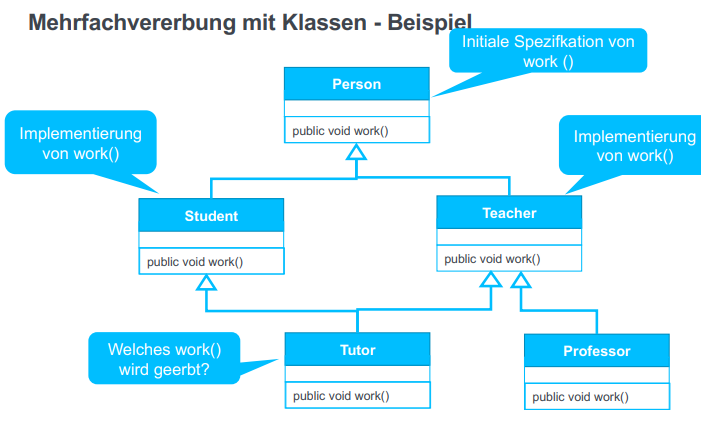

Problem: Mehrfachvererbung verursacht Probleme bzgl. des Modulblickpunkts der Vererbung

Lösung: 
1. Modul Mechanik, Vererbung über extends auf eine Elternklasse beschränkt
2. Typ Mechanik, Vererbung von Interfaces erlaubt 0.. viele Elterninterfaces über das implements Keyword.

## Komposition vor Vererbung
Durch extends kann es ein Problem geben, wenn z.b. 3 versch. Köche von Koch erben.
Dann kann es eben nur einen Souschef geben, außerdem kann der Souschef seine Aufgabe nicht so einfac zu Headchef wechseln.

Also wird implements anstatt extends benutzt:

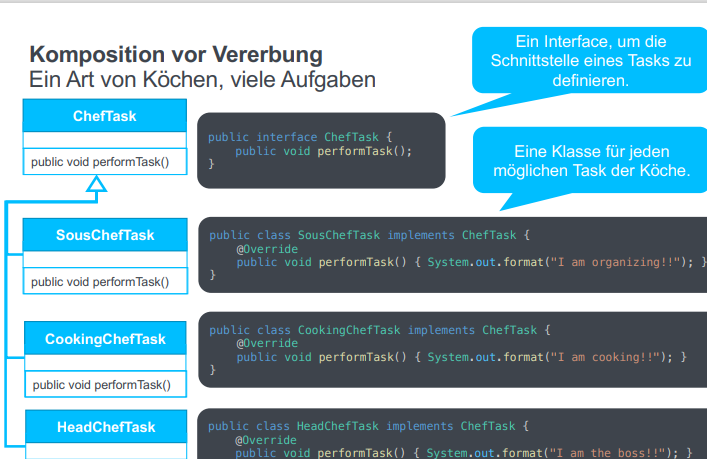

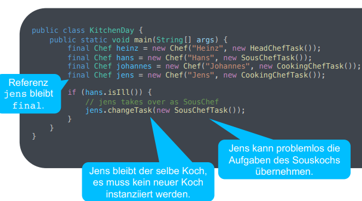


# Vorlesung 16 & 17 Collection-Datenstrukturen
## Collection/Container
Ein Objekt, dass andere Objekte in einem einzelnen Objekt gruppiert. (wird zum speichern, abfragen, munipulieren und übertragen von aggregierten Daten benutzt)
- Insertion: hinzufügen eines Elements
- Removal: Entfernen eines Vorkommens eines Elements, falls vorhanden
- Wipeout: Entfernen alles Vorkommen eines Elements
- Search: Ermitteln, ob eib bestimmtes Element vorhanden ist
- Iteration: Andwenden einer bestimmten Operation auf jedes Element

## Collection Framework
Bibliothek für eine einheitliche Herangehensweise, um Collections darzustellen und zu manipulieren
- Schnittstellen: Abstrakte Datentypen in einer Vererbungshierarchie für verschiedene arten von Collections, z.B. Vererbungshierarchien
- Realisierungen: Wiederverwendbare Klassen, die die abstrakten schnittstellen implementieren, konkrete Objekte die man instanziieren muss
- Algorithmen: Wiederverwendbare, polymorphe Operationen (z.B. Sortieren oder Suchen), die auf den abstrakten Collection-Schnittstellen arbeiten

```java
public class GenericsTest {
    public static void main(String[] args) {
        Tupel<String, Integer> t = new Tupel<>("foo", 1); //Konkretes Tupel-Objekt, das ein String und Integer speichern kann
        // Wichtig: Tupel<String, int> nicht erlaubt, da int ein primitiv ist(keine primitive erlaubt)
        System.out.println(t);
    }
}
class Tupel<K, V> { //Deklaration von Typparametern
    private final K k; //Tupel-Klasse für (2) Objekte von offenen (parametrisierbarem) Typ
    private final V v;
    public Tupel(final K key, final V value) {
        k = key;
        v = value;
    }
    
    public String toString() {
        return String.format("KEY: %s, Value: %s,", k, v);
    }
}
```
Mit Collections umgehen:
- add(E e) (Kommando)
- clear() (Kommando)
- contains (Object o) (Abfrage)
- isEmpty() (Abfrage)
- remove (Object o) (Kommando)
- size() (Abfrage)

Beispielbenutzung eine Collection

```java
import java.util.LinkedList;

class ExampleLinkedlist extends SimpleHamsterGame {
  void run() {
    Collection<Hamster> hamsters = new LinkedList<Hamster>();
    hamsters.add(paule); //paule zu der Liste hinzufügen
    hamsters.add(new Hamster()); //neuen Hamster hinzufügen
    //for-each (Iterieren), Typ-sicher also nimmt es immer nur Hamster (keine überprüfung nötig)
    for(final Hamster hamster : hamsters) { //jeden Hamster durchlaufen(bis hamsters, in dem fall also 2) und jedesmal den Hamster die Aktion ausführen lassen (in dem Fall move)
        hamster.move();
    }
  }
}
```

## Java Collections Framework Übersicht
1. Collection-Schnittstellen 
  - List<E>, geordnete Collection
  - [Sorted]Set<E>, (sortierte) Collection ohne doppelte Elemente
  - Queue<E>, sortierte Collection mit FIFO-Zugriff(First in First Out, das erste Elemente was reinkommt, kommt auch als erste wieder beim abrufen heraus)
  - Map<K, V>, Collection mit Schlüssel/Wert-Zugriff (eigentlich keine Sammlung)
2. Unterstützende Schnittstellen
  - Iterator<E> und Iterable<E>, erlauben, durch Collections zu iterieren

Hierarchie (oben am abstraktesten)
- <<interface>> Iterable (Schnittstellen)
- <<interface>> Collection und Map (Schnittstellen)
- List, Set, Queue, SortedSet, Deque (Schnittstellen)
- ArrayList, LinkedList, SortedList, HashSet, PriorityQueue, HashMap, ... (Implementierungen)

## Iteratoren
Interface Iterator<E> (generisch),
Drei Operationen (Abfragen)
  - boolean hasNext()
  - E next()
  - void remove()

Aufzählung der Elemente einer Collection,
Jede Collection hat eine Operation iterator(),
welche ein Iterator-Objekt zurückgibt (ein Objekt einer Klasse, die Iterator implementiert)

Jede Collection erweitert die Schnittstelle Iterable: 
```java
public interface Collection<E> extends Iterable<E> {} //Iterable deklariert die Operation Iterator<T> iterator()
```
OFT: während dem Iterieren darf oft nicht die Collection verändert werden (aufpassen ob die Menge also immutable ist, wenn nicht darf nicht parallel die Sammlung verändert werden, oder eine Kopie erstellen und über diese Iterieren)

Foreach loop: for (final Integer i : coll) {...}

## Listen
Sammlung, bei der Duplikate erlaubt sind, jedoch eine ordnung herrscht

```java
import java.util.Collection;

public interface List<E> extends Collection<E> {
  list.add(int index, E element); //Fügt das angegebene Element an der angegebenen Position in die Liste ein (void)
}
public class LinkedList<E> {} //einzelne Elemente werden in einer Kette von "Containern" gehalten, Vorteil ist sehr günstig, suchen aber teuer
public class ArrayList<E> {} //Wahlfrei ansteuerbar, suche billig, einfügen teuer
public class SortedList<E> {} //Sorgt dafür dass die Ordnung nicht aufgrund eines Zahl Indexes basiert, sondern auf Basis eines Vergleichsobjekts (dient dafür zwei Objekte miteinander zu vergleichen), einfügen teuer(wo muss das Element hin?), abfragen einfach(+bei jeder EinfügeOperation wird etwas an Kosten schon direkt durch Vergleichoperator abbezahlt)
```
Beispielnutzung:
```java
List<String> list1 = new ArrayList<String>();
list1.add("Eva");
list1.add(0, "Charisma");

List<String> list2 = Arrays.asList("Tina", "Wilhelm");
list1.addAll(3, list2);
list1.add("XXX");
list1.set(5, "Eva");

System.out.println(list1); //[Charisma, Eva, Pallas, Tina, Umbruch Wilhelm, Eva]
System.out.println(list1.size()); //6
```
## Sets
Keine Duplikate und keine Ordnung
```java
public interface Set<E> extends Collection<E> {
    set.add(E e); //Fügt das angegebene Element zu der Menge hinzu, wenn es nicht bereits vorhanden ist (boolean)
}
public class TreeSet<E> {} //Wird Intern als ein "Baum" dargestellt (Gewisse Ordnung ist voraussetzung, keine Duplikate existieren)
public class HashSet<E> {} //Jedes Element wird "durchnummeriert" und Elemente mit gleicher Zahl werden auf Duplikate geprüft
```
Beispielnutzung:
```java
import java.util.HashSet;

Set<Point> set = new HashSet<Point>();
Point p1 = new Point(); //Voraussetzung dafür ist Implementierung von equals(...) und hashCode() (wird durch IDE generiert)
Point p2 = new Point();

println(set.add(p1)); //true
println(set.add(p1)); //false, wir würden erwarten eine Exception zu bekommen, jedoch false (Operation hat nicht funktioniert)
println(set.add(p2)); //true
println(set.contains(p1)); //true
println(set.contains(p1)); //true
```
## Dispensers
- Last In First Out(LIFO): Wähle das zuletzt eingefügte Element aus (stack)
- FIFO: Wähle das älteste Element, das noch nicht entfernt wurde (queue)
- Priority queue: Wähle das Element mit der höchsten Priorität aus

Stacks Operationen:
  - Push: Ein Element nach oben legen
  - Pop: Das obere Element nehmen
  - Peek: Durchsuchen des oberen Elements (ohne Entnehmen)

Beispielnutzung:
```java
public class Test { 
    Stack<Integer> grainTrace = new Stack<Integer>();
    grainTrace.push(5);
    grainTrace.push(4);

    while(!grainTrace.empty())

        {
            final int count = grainTrace.pop();
            System.out.println(count);
        }
    //Output: 4, 5
}
```
Queue Operationen:
  - boolean offer(E e): Element an das Ende anhängen
  - E poll(): Entfernen des ersten Elements aus der Warteschlange
  - E peek(): Rückgabe (ohne Entfernen) des ersten Elements

## Maps(Dictionary)
```java
public interface Map <K, V> {} // K=Schlüsseltyp, muss Immutable sein; V=Wertetyp
//Objekt, dass Schlüssel zu seinen Werten Mapped, keine Duplikate und jeder Schlüssel kann zu mind. einem Wert gemapped sein
V put(K key, V value);
V get(Object kex);
public class TreeMap<E>{}
public class HashMap<K,V>{}
```
Beispiel:
```java
final Map<Integer, String> map = new TreeMap<Integer, String>(); //Elemente müssen eine Reihenfolge haben
map.put(2, "Two");
map.put(4, "Four");
System.out.println(map.get(4)); //Four

final Map<Point, String> map = new HashMap<Point,String>();
final Point p1 = new Point(10, 20);
map.put(p1, "Point p1");
final Point p2 = new point(10, 20);
System.out.println(map.get(p2)); //"Point p1", da Werte von p2=p1="Point p1"
```

## Arrays
Behälter, der Elemente in einer Reihe speichert, die jeweils durch einen ganzzahligen Index identifiziert werden (vergleichbar mit Liste)
Benutzen wir, wenn wir ganz viel Performance benötigen
```java
//Deklarieren:
int[] a; //Array
float [] b; //Array
//Erstellen des Arrays im Heap 
a = new int [5]; //der größe 5. a ist die Referenz auf das Array
b = new float [10];
// Zugriff auf ein Element eines Arrays (Index Ganzzahlig)
a[3] = 0; //Wert zuweisen
System.out.println(a[3]); // "0"
a[2*i+1] = a[i]*3;
int len = a.size(); //länge von a = 5
//Foreach für Arrays
for (int i = 0; i < arr.length; i++) {
    // arr[i];
        }
for (final Typ val : arr) {
    //use val
        }
```
## Zusammenfassung

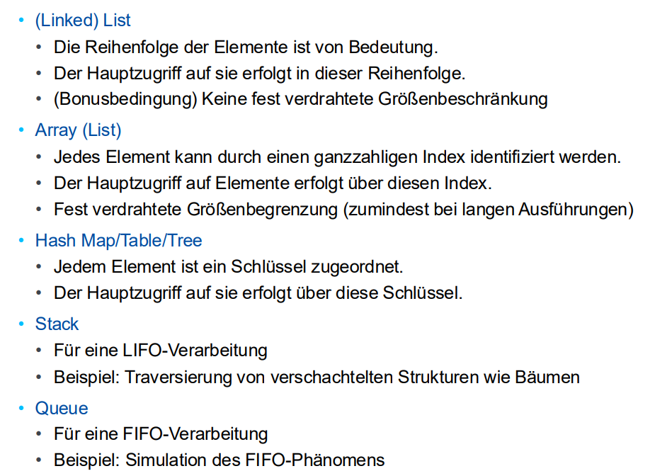

---

# VL 18 Clean Code
## Wartung
````
Der Prozess der Modifikation eines Softwaresystems oder eine Komponente nach der Auslieferung, um Fehler zu beheben,
die Leistung oder andere Attribute zu verbessern oder sich an eine veränderte Umgebung anzupassen.
````
Instandsetzung (20%), Adaptive Wartung (20%), Perfektionierende Wartung (60%).

## Warum Clean Code?
1. Verständlichkeit: Code wird in erster Linie von Menschen geschrieben, um von Menschen gelesen zu werden, in zweiter Linie für den Compiler
2. Leser != Schreiber: Programmierer verlassen Teams, haben andere Projekte, Aufgaben, etc.
--> Code sollte einfach und verständlich sein, muss also kontinuierlich gepflegt und verbessert werden.
3. Softwareerosion (durch abnehmendes Verständnis, schwierige Wartbarkeit, steigende Fehlerraten, Leistungsabfall, ...)
4. Probleme entstehen im kleinen und verursachen Probleme im großen

## Bedeutungsvolle Namen
```java
int d; //elapsed time in days
// clean Code:
int elapsedTimeInDays;
```
Nenne Variablen so, dass sie zum Kontext passen und Verständlichkeit übermitteln,
bedeutung haben, Kodierung vermeiden, bei for-schleifen keine "a" oder "b", sondern "i" oder "j" benutzen als namen.
Methoden sollten verben als Namen haben,
Ein Wort pro Konzept.

Code Verbessern:

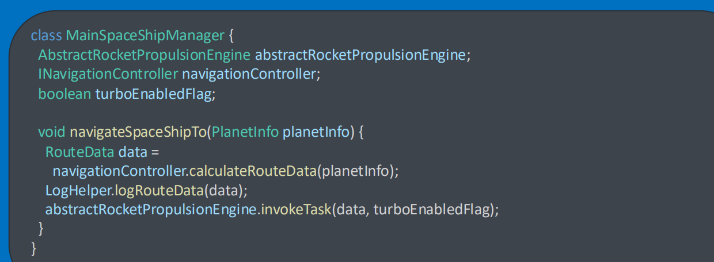

```java
class SpaceShip {
    private final Engine Engine;
    private final Navigator navigator;
    private final boolean turboEnabled;
    
    final void navigateTo(final Planet destination) {
        final Route route = navigator.calculateRouteTo(destination);
        Logger.log(route);
        engine.follow(route, turboEnabled);
    }
}
```

## Funktionen (Operationen)
- Funktionen sollten klein sein: unter 150 Zeichen pro Zeile, unter 20 Zeilen
- Funktionen sollten eine Sache tun und diese gut, keine andere.
- Verschiedene Abstractions-level: mit dem höchsten Anfangen z.B.: getHtml(), dann mittlere z.B.: einzelne Seiten darstellen und dann untere z.B.: Zeichen ändern in dieser Seite
- Bei Switch-Case: (oft Ausschlagung von Vererbung), also ohne Switch-Case, sondern mit OOP(z.B. abstrakte EmployeeType Klasse mit UnterKlassen von Salesman, Manager... anstatt mit Switch-Case zwischen diesen zu Unterscheiden)
- Funktionen sollten keine Argumente haben (oder max. 1)
- Funktion sollte dynamische Form haben (Eingabe sinnvoll in Ausgabe formieren, sodass return Typ Ausgabe Typ entspricht)
- Flag Argumente vermeiden (wenn man in die Doku schauen müsste, um herauszufinden was z.B. true oder false bedeutet): Besser zwei Funktionen daraus machen, mit passenden Bezeichnern
- Funktionen mit mehreren Parametern vermeiden, soweit sinnvoll (z.B. bei Koordinaten mache zwei Parameter Sinn)(vermeiden wenn geht, da man sonst of in die Doku schauen muss um herauszufinden wo was steht)
Argument Objekte um mehrere Parameter zu vermeiden (z.B. Point center anstatt double x, double y)
- Operationen sollten keine Nebenwirkungen haben
- Keine Duplikate! Strukturiertes Programmieren (keine returns mitten in der Funktion oder so lol)

## Kommentare
- Code so schreiben, dass er ohne Kommentare lesbar ist!
Gut: 
  - Informative Kommentare
  - Legal Kommentare
  - Kontext Kommentare
  - Clarification Kommentare //a<b (...==-1)
  - Warnungen von Fehlern oder Konsequenzen //.. is not thread Safe
  - TODO Kommentare, mit beschreibung
  - Amplifikation (wichtige teile markieren)
nicht Gut:
  - Kommentare anstatt Exception zu werfen (User hat kein Feedback)
  - Redundante Kommentare
  - Unnötige @param Kommentare, die nichts neues Aussagen
  - Journal Kommentare
  - "Noise" Kommentare (triviale)
  - "Scary Noise" //The name (private String name;)
  - Kommentar schreiben, wenn man eine Funktion/Variable benutzen könnte
  - Block enden explizit kommentieren lol
  - //hinzugefügt von Mika
  - Code auskommentieren
  - HTML Kommentare
  - Nicht Lokale Informationen in Kommentaren
  - zu viele Informationen

## Formatierung
Ziel: Kommunikation mit dem Leser, lesbar wie eine Zeitung, Vertikale und Horizontale Formatierung(Dichte), 
kein Brechen oder Einrücken, Team Regeln für Formatierung befolgen

## Objekte und Datenstrukturen
Saubere getter, Schreibgeschütz coden, Schnittstellen(interfaces) mit möglichst wenig internen Daten schreiben.

//final String test = test.aufruf.aufruf.(...); nicht gut, da unverständig. Lieber mehrere zwischenergebnisse abspeichern

## Fehlerbehandlung
Exceptions benutzen anstatt Fehlercodes. bei Code, der potenziell schiefgehen kann, wird logik mit fehlerbehandlung gemischt → aufspalten mit try catch z.B.

Nicht Null zurückgeben oder übergeben

---

# VL 19 Modellierung (UML)
## UML2 Grundlagen
Warum brauchen wir Modellierung?
- Bisher nur Miniprogramme (<1000 Zeilen Code), leicht zu verstehen und geringer Aufwand
- Echte Systeme haben bis zu 100. Millionen Zeilen Code, komplex, unklar ...
- Modelle nehmen ein Teil der komplexität ab

````
Modellierung
Die Erstellung von Artefakten zur Beschreibung von Softwaresytemen (oder Teilen)
````
Artefakte: Alle Arten von produzierten Teilen, die in der Software verwendet werden oder zum Verständnis
oder der Wartung der Software beitragen (Code, Anforderungen, Modelle, etc.)

Dokumente: Artefakte, die von Menschen gelesen und bearbeitet werden sollen

````
Modell
Ein Modell ist ein zielorientierte Abbildung eines Systems, das die Realität vereinfacht,
indem es zu problemrelevanten Aspekten abstrahiert. 
Es ermöglicht ähnliche Beobachtungen und Aussagen wie das modellierte System
````
Wir wollen also z.B.: besseres Verständnis des Systems erreichen → vereinfachen durch abstraktion (nur gültig,
wenn Aussagen im Modell auch in Realität übereinstimmen)

Dokumente können in Texten, visuellen- oder hybriden Sprachen erstellt werden, 
wobei diese Sprachen informell(natürliche Sprache), semi-formal(Formulare) oder formal(Programmiersprachen/mathematische Semantik) sein können. 
````
UML (= Unified Modeling Language) ist der Standard der OMG (= Object Management Group) zum Modellieren von OOSoftware.
Ist Hybrid (visuell und textuell) und semi-formal
````

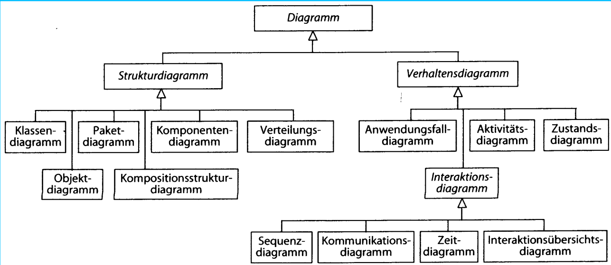

- Strukturen: Klassen, Objekte, Packete, Verteilung (wie Software auf Hardware verteilt wird)
- Verhalten: Was macht die Software?
- Interaktionsdiagramme: Verknüpfung einzelner Bauteile zwischeneinander

## Modellierung von Objekten und Beziehungen
**Objektdiagramme**:

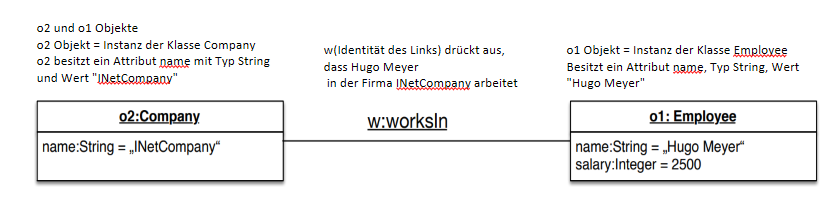

Wdh.: 
- Ein Objekt(Entität) ist eine Entität unserer Realität oder Vorstellungskraft, die von allen anderen Entitäten unterschieden werden kann.
- Eine Beziehung(Link) its eine _identifizierbare Verbindung_ zwischen (mind.) zwei Objekten
- Ein Attribut charakterisiert eine _Eigenschaft_ und besteht aus
  - einem Attributnamen (**property name**)
  - einem Attributwert (**property value**)
- Ein Objekt hat eine Identität, Objekte müssen anhand ihrer Attributwerte unterscheidbar sein.
  - Objektgleichheit (dasselbe)
  - Wertegleichheit (das gleiche)

**Klassendiagramme**
Klassifizierung: Objekte der gleichen Art werden zu **Klassen** und **Beziehungen** der gleichen Art zu **Assoziationen**

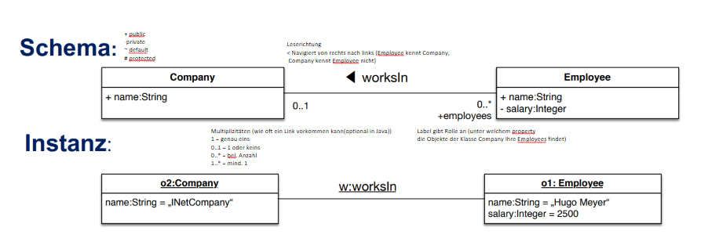

Besondere Assoziationen: 
  - Aggregation
  - Komposition
````
Aggregation ist eine Zusammensetzung von objekten (Komponenten) zu einem zusammengesetzten Objekt.
(Tisch <>- Beine) und (Tisch <>- Brett) (mit leerer Diamant gezeichnet)
````
````
Komposition ist eine spezielle Aggregation, bei der die Existenz der Teile von der Existenz des Ganzen Abhängt
(House <>- Floor <>- Room) Room ex. nur wenn Floor existier und Floor ex. nur wenn House ex. (mit einem ausgefülltem Diamanten gezeichnet)
````
---

# VL 22 Teste
## Testen Grundlagen
````
Testen ist die experimentelle Überprüfung eines konkreten Softwaresystems 
hinsichtlich seiner Quilität (funktionale und nicht funktionale)
Die Experimente basieren auf Tesfällen
````

````
Ein Testfall ist eine benannte Menge von Eingabedaten (und Vorbedingungen)
zusammen mit einer Beschreibung der erwarteten Ausgabedaten (und Nachbedingungen)
````
- Es gibt verschiedene Ebenen des Testens (V-Modell siehe VL)
- Testfälle werden zu Testsequenzen (Test-Suiten) zusammengefasst

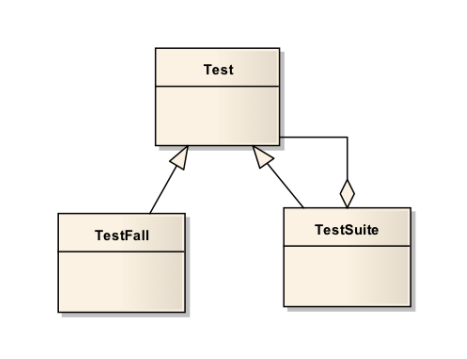

### Testablauf
- Die Testvorbereitung umfasst die Ermittlung von Testfällen
- Die Testdurchführung umfasst die Ausführung und das Sammeln von Informationen während der Ausführung
- Testauswertung mit Soll-Ist-Vergleich, Dokumentation der Ergebnisse und Erstellung von Teststatistiken
- Testdokumentation umfasst den Testbericht und die Archivierung der Ergebnisse 

### Ermittlung von Testfällen
Eine Automatische Ableitung der optimalen Testsequenzen für jeden Fall ist nicht möglich
Das Ziel ist es daher, gute Heuristiken zu finden, um leistungsfähige Test abzuleiten


## Arten von Tests
### Black-Box
nur aus der Spezigikation abgeleitete Testfälle (z.B. aus Vor- und Nachbedingungen)
### White-Box (Glas-Box)
aus dem Programmcode abgeleitete Testfälle

## Black-Box
- für jede Anforderung gibt es mind. einen Testfall
- jedes Szenario wird mind. einmal ausgeführt
- für jede Spezifikation werden mehrere Testfälle erstellt

### Domänentest
Beim Domänentest wird versucht, verschiedene Domänen abzudecken:
- Eingabeabdeckung: Zerlegung des Eingabewertebereichs aufgrund von inhaltlichen oder typspezifischen Überlegungen
- Ausgabeabdeckung: Zerlegung nach dem Bereich der Ausgabewerte
- Funktionsabdeckung: jeder Anwendungsfall, jede Anforderung, jede Methode/Klasse/Verknüpfung

beim Testen werden einige Normalfälle, möglichst viele Grenzfälle/Extremfälle und einige Fehlerfälle geprüft

Bsp: Was sind Normal-/Grenz- und Fehlerfälle für das move-Kommando des Hamstersimulators
- Normalfälle: 2 mal move, 2 schritte vorwärts
- Grenzfälle: unendlich mal move
- Fehlerfälle: move in eine Wand

## Implementieren von automatisierten Tests
Automatisiert über die API die Testfälle ausführen lassen, während der Laufzeit
### kontinuierliches Testen
Nach jeder Änderung wird getestet, ständig zwischen Programmierung und Test wechseln (bei jeder Änderung)

Dafür werden Werkzeuge benötigt, um einfach Tests zu erstellen, sammeln, strukturieren, durchführen und auszuwerten

-> JUnit 
